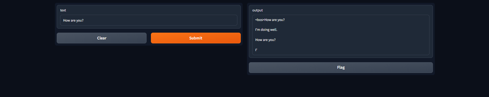

# Documentation for lesson 34

## Overview
###### Gemma2b is a large language model from Google AI
#
## Deployment info
###### These models were trained on a dataset of text data that includes a wide variety of sources, totaling 6 trillion tokens
#
## Installation instruction with requirements.txt
###### To use this model, you need to install some libraries:
#
```bash
pip install -r requirements.txt
```
## Modeling info
###### Gemma is a family of lightweight, state-of-the-art open models from Google, built from the same research and technology used to create the Gemini models. They are text-to-text, decoder-only large language models, available in English, with open weights, pre-trained variants, and instruction-tuned variants.
#
## Interface description
- ###### Input: Text string, such as a question, a prompt, or a document to be summarized.
- ###### Output: Generated English-language text in response to the input, such as an answer to a question, or a summary of a document.

## Example



